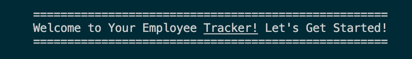

# Employee Tracker CMS

## Usage

For an example of the Employee Tracker CMS in action, just watch this walkthrough: https://drive.google.com/file/d/1iAomKoLx99m-yUm-8LU0kYWnuV9kBbBM/view

## Description

A simple Command Line employee tracker for managing several aspects of your company.  With the Employee Tracker, you'll be able to view your departments, company roles, employees, and view employees based on their departments or managers. You'll be able to add new departments, roles, or employees. You can update current employees, roles, managers, or a role's salary.  You can delete employees, roles, or departments from the database. And you can even view a utilized budget for each department.  It can truly do it all! 

## Installation

Just clone this repository and run npm install mysql2 sequelize console.table, and then you're ready to go.

## Questions?

For any further questions, you can find my github profile here: https://github.com/MrSumada
